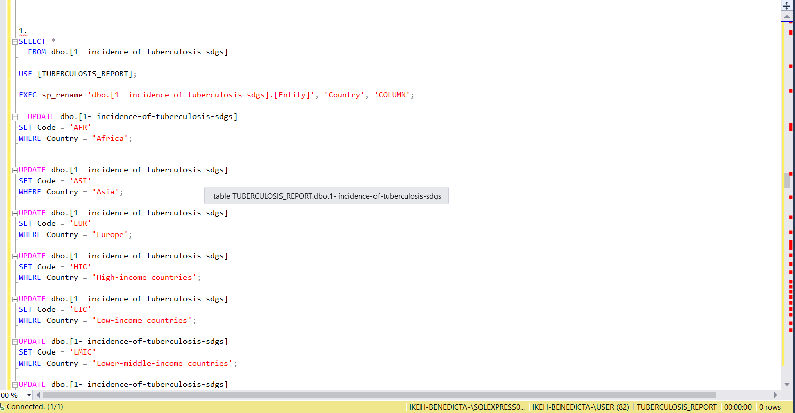
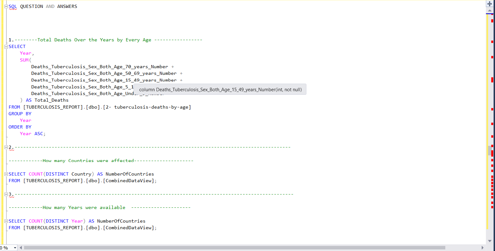
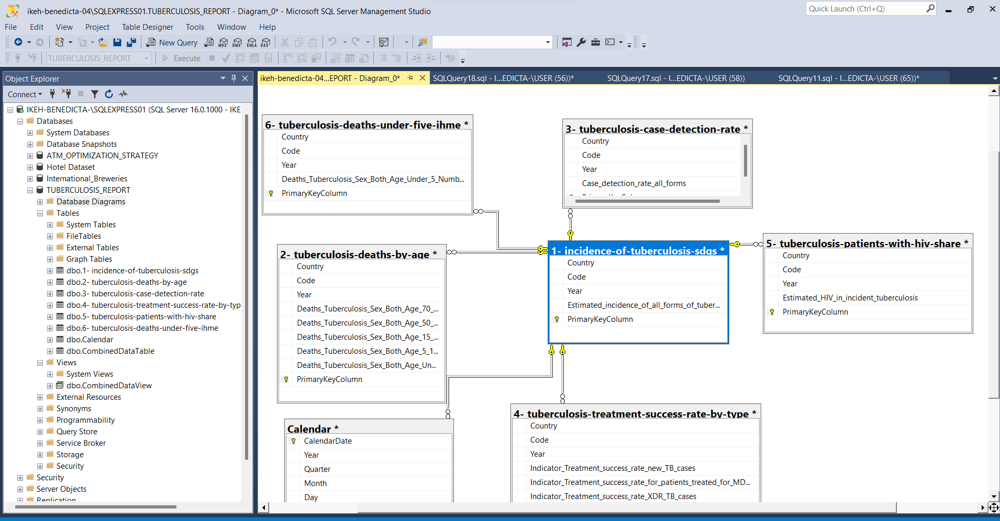
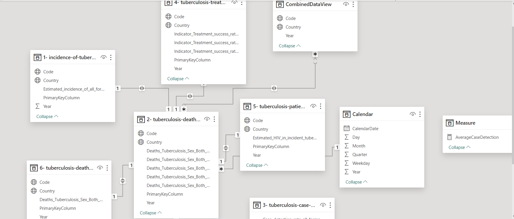
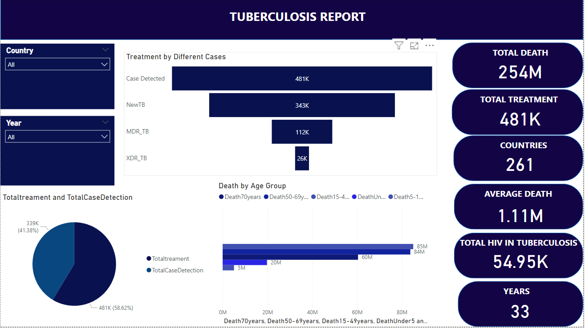
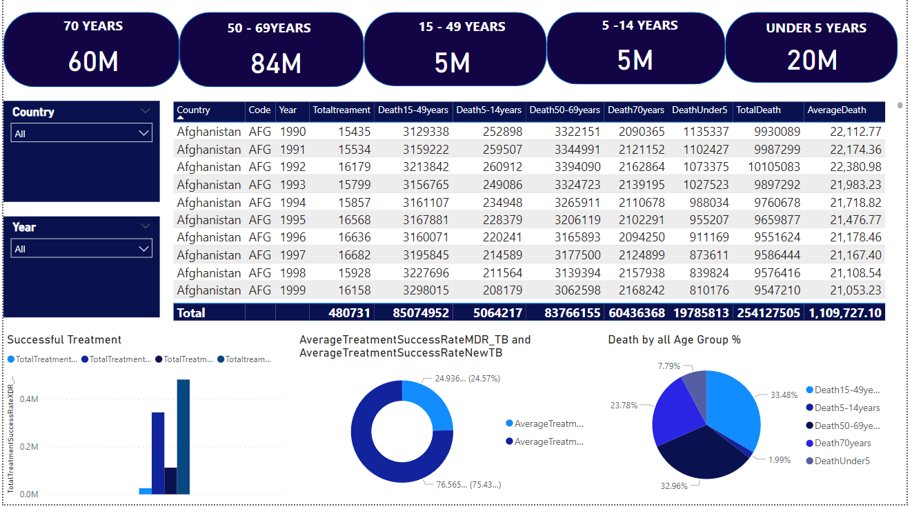

# TUBERCULOSIS REPORT FROM 1990 - 2022

---

## Introduction

Tuberculosis (TB) stands as a pervasive and persistent global health challenge, claiming an estimated 1.2 million lives annually and leaving an indelible mark on societies worldwide. Authored by Saloni Dattani, Fiona Spooner, Hannah Ritchie, and Max Roser, this report critically examines the multifaceted landscape of TB, highlighting its nuanced impact across different socioeconomic strata. As we traverse the intricate web of data, we uncover the disparities in TB prevalence between richer and poorer nations, explore the intricate details of Mycobacterium tuberculosis – the bacterium responsible for TB – and delve into the risk factors, symptoms, and treatment challenges that define the global fight against this ancient yet resilient disease. Through this exploration, we set the stage for a comprehensive understanding of the current state of TB, paving the way for informed discussions on the urgent measures required to consign this formidable adversary to the annals of history.

---

## ATM Objective

 This report aims to elucidate the current global impact of tuberculosis, shedding light on the persisting challenges faced in both affluent and impoverished regions, with a particular focus on the stark contrasts in disease prevalence. By delving into the intricacies of Mycobacterium tuberculosis, the causative agent of TB, the objective is to provide a comprehensive understanding of its transmission mechanisms and the biological factors contributing to its prevalence in specific populations.
The report seeks to highlight the significance of risk factors such as undernourishment, HIV/AIDS, smoking, and chronic conditions in amplifying the impact of tuberculosis, emphasizing the need for targeted interventions to mitigate these factors. With a clear emphasis on the imperative of accurate diagnosis and effective treatment, the report aims to underscore the role of accessible healthcare, diagnostic tools, and antibiotic treatment protocols in reducing the burden of tuberculosis globally, ultimately working towards relegating this ancient disease to history.
Investigate the global prevalence and distribution of tuberculosis, examining how the impact varies across regions and elucidating the current status of the disease in both affluent and impoverished nations. Explore the molecular and epidemiological aspects of Mycobacterium tuberculosis, the causative agent of tuberculosis, aiming to provide a comprehensive understanding of its transmission dynamics, virulence factors, and genetic variations.
Analyze the influence of key risk factors such as undernourishment, HIV/AIDS, smoking, and pre-existing chronic conditions in exacerbating tuberculosis incidence, emphasizing the need for targeted interventions to address these risk factors. Assess the challenges in diagnosing and treating tuberculosis, with a focus on the importance of early detection, accurate diagnosis, and the implications of undiagnosed cases in fueling antibiotic resistance, ultimately contributing to strategies for improved testing and treatment worldwide.

---

## Tools Used

1. Microsoft SQL : SQL is employed to extract, organize, and optimize tuberculosis data from underlying databases.
   
2. Microsoft Power BI Desktop: Power BI is utilized for dynamic and interactive visualization, leveraging DAX functions for insightful analytics.

Collaborate SQL and Power BI functionalities to establish a dynamic and interactive reporting platform, allowing end-users to explore the tuberculosis data through intuitive dashboards, charts, and graphs. Ensure data security and integrity by implementing SQL best practices and leveraging Power BI's authentication and access control features to restrict and manage data access appropriately.

---

## Dataset Description

These datasets offer a comprehensive exploration of the global landscape of tuberculosis, encompassing various dimensions of the disease:

1. Incidence of Tuberculosis:  Capturing the worldwide prevalence of tuberculosis, this dataset illuminates the ongoing challenges in different regions. It contrasts the historical decline in high-income countries with the persistent health threat faced by other parts of the world, providing a nuanced understanding of the disease's prevalence.

2. Tuberculosis Deaths: Painting a somber picture, this dataset outlines the annual toll of tuberculosis-related fatalities, underscoring its significant impact on the global adult population. The accompanying chart visually emphasizes the stark reality that tuberculosis remains a prominent cause of death, particularly among adults, highlighting the urgency for targeted interventions.

3. Tuberculosis Case Detection: Focused on the underdiagnosis of tuberculosis cases, this dataset sheds light on the challenges in detecting the disease. It explores atypical symptoms beyond respiratory issues, emphasizing the need for heightened awareness and improved diagnostic approaches to identify cases that may not exhibit conventional signs.

4. Tuberculosis Treatment Success Rate: Addressing the critical aspect of antibiotic resistance during treatment, this dataset outlines the specific medications required for tuberculosis treatment. It underscores the importance of adherence to prescribed regimens for successful outcomes and highlights potential challenges posed by antibiotic-resistant strains, urging a vigilant approach.

5. Tuberculosis Patients with HIV: Highlighting the intersection of tuberculosis and HIV, this dataset explores how an HIV infection significantly increases the risk of developing tuberculosis. It underscores the interconnectedness of these health issues, emphasizing the importance of targeted interventions for individuals facing the dual burden of both diseases.

6. Tuberculosis Deaths Under Five: This dataset concentrates on tuberculosis-related fatalities in children under the age of five, offering a poignant perspective on the disease's impact on a vulnerable demographic. By highlighting mortality rates within this age category, it stresses the need for specific interventions and healthcare strategies to mitigate risks and enhance the well-being of young children affected by tuberculosis. Together, these datasets provide a holistic view, informing efforts to understand, prevent, and manage tuberculosis globally.

These datasets collectively provide a comprehensive view of the current state of tuberculosis globally, covering its incidence, mortality rates, challenges in diagnosis, treatment considerations, and the impact of co-existing conditions, such as HIV.

---

## Data Sourcing 

It enforces the understanding with the intricacies of global health challenges is paramount. Tuberculosis, a persistent threat, has prompted researchers and analysts to delve into comprehensive datasets to gain insights into its prevalence, mortality rates, detection challenges, treatment dynamics, and the intersection with other health conditions. This article explores the nuances of sourcing data from tuberculosis datasets, shedding light on the significance of each dataset and the valuable insights they offer. In the realm of global health analysis, sourcing data from tuberculosis datasets provides a comprehensive understanding of the disease's multifaceted nature. These datasets, each offering a unique perspective, contribute to the collective efforts to combat tuberculosis, inform policy decisions, and drive advancements in healthcare strategies worldwide.

---

## Data Transformation

In the realm of public health, data-driven decision-making is paramount. Tuberculosis, a persistent global health challenge, demands a meticulous approach to data transformation for comprehensive analysis. This article explores the pivotal steps taken in the data transformation process, shedding light on the significance of each enhancement made to the tuberculosis report.
Introduction:
As we navigate the complex landscape of global health, tuberculosis stands out as a critical concern, prompting a closer look at the data that underpins our understanding of its prevalence, mortality rates, case detection challenges, treatment dynamics, and intersection with other health conditions. The transformation of raw data into meaningful insights involves several key steps.
1. Filling in the Missing Words: The initial step in enhancing the tuberculosis report involved meticulously reviewing and editing the code tables. Ensuring completeness, missing words were added to all six tables. This attention to detail is crucial for maintaining the accuracy and clarity of the data, providing a solid foundation for subsequent analyses.
2. Introducing Primary Keys: To establish robust data integrity, primary keys were added to each table. These primary keys serve as unique identifiers, facilitating efficient data retrieval and ensuring that each record in the table can be uniquely identified. This structural enhancement not only strengthens the tables individually but also lays the groundwork for relational connections between tables.
3. Answering SQL Questions: As part of the data transformation process, specific SQL questions were addressed. This involved crafting queries that extracted targeted information from the tables, providing actionable insights into the intricacies of tuberculosis data. These SQL responses contribute directly to the analytical capabilities of the dataset.
4. Combined Table for Comprehensive Analysis: To streamline the analysis process and consolidate relevant information, a combined table was introduced. This table aggregates data from all six individual tables, incorporating columns pertinent to each aspect of tuberculosis analysis. The combined table acts as a centralized repository, simplifying the task of retrieving comprehensive insights from diverse datasets.
Conclusion: The transformation journey of the tuberculosis data report represents a meticulous and purposeful effort to refine raw data into a format conducive to meaningful analysis. From filling in missing words to introducing primary keys, answering SQL questions, and creating a consolidated table, each step contributes to the overall robustness of the dataset. As we continue to explore the multifaceted nature of tuberculosis, these data enhancements pave the way for informed decision-making, policy formulation, and advancements in healthcare strategies worldwide. The commitment to data accuracy and completeness underscores the importance of a thorough data transformation process in unraveling the complexities of global health challenges.

SQL Example1          |   SQL Example2
:---------------------| :----------------------:
      |     

---

## Data Modelling

The data was done with the  Snowflake data modeling framework, tables interconnect through primary keys, serving as unique identifiers for individual records within each table. These primary keys are pivotal in establishing relationships between different tables in the database.

These relationships, ranging from one-to-one to one-to-many or many-to-many, define the manner in which data is related across various tables. Filtering tables in Snowflake involves leveraging SQL queries that incorporate conditions based on specific columns. 
Snowflake's versatility is further evident in its ability to perform joins, where data from multiple tables is combined using SQL JOIN operations. This facilitates the extraction of comprehensive insights by merging information from related tables. Understanding and utilizing these relationships, keys, and querying mechanisms are crucial for constructing meaningful analyses within the Snowflake data model. Ultimately, the elegance of Snowflake lies in its relational approach, enabling efficient management and extraction of insights from interconnected datasets.

Sql_Relationship              |   BI_Relationship
:---------------------        | :----------------------:
      |     

---

## Analysis and Visualization

The analysis of tuberculosis data reveals critical insights into the global impact of this persistent health challenge. With a total death toll reaching 254 million, treatment efforts totaling 481 thousand, spanning 261 countries, and a significant 1.11 million cases of HIV coexisting with tuberculosis, the numbers underscore the urgency for comprehensive strategies.
Global Overview: The sheer scale of the data emphasizes the widespread nature of tuberculosis, affecting nations across the globe. The reported treatment figures of 481 thousand reflect ongoing efforts, yet the substantial death toll of 254 million signals the persistent challenges in managing and eradicating this disease. These figures necessitate a concerted global response to mitigate the impact.
HIV and Tuberculosis Intersection: Highlighting the intersectionality of health issues, the data unveils a significant coexistence of HIV with tuberculosis, with 1.11 million cases. This dual health burden demands targeted interventions and collaborative efforts to address the unique challenges presented by individuals grappling with both conditions.
Age-Stratified Analysis: The age-stratified analysis provides a nuanced understanding of the demographics affected by tuberculosis-related deaths. Children under 5 years bear a substantial burden, with a death toll of 20 million, emphasizing the vulnerability of this age group. The age group of 5 to 14 years reports 5 million deaths, and the 15 to 49 years and 50 to 69 years age groups each account for 5 million and 84 million deaths, respectively. The 70 years and above age group reports 60 million deaths. These statistics underscore the diverse impact of tuberculosis across different age cohorts, necessitating tailored interventions for each group.
Conclusion: In conclusion, the analysis of tuberculosis data reveals a complex and multifaceted global health challenge. The high death toll, the coexistence of HIV, and the age-specific impacts underscore the urgency for targeted interventions, increased awareness, and global collaboration. This comprehensive understanding of the data is instrumental in shaping effective public health strategies to combat tuberculosis and mitigate its devastating effects on individuals and communities worldwide.

Tuberculosis_Dashboard        |  Death_Rate_Dashboard
:---------------------        | :----------------------:
             |     

---

## Conclusion

The exhaustive analysis of tuberculosis data, conducted with the aid of powerful tools such as SQL and Power BI, provides a panoramic view of the global landscape surrounding this persistent health issue. With a staggering total death count of 254 million, treatment efforts reaching 481 thousand, and a prevalence spanning 261 countries, the gravity of tuberculosis as a global health concern cannot be understated.
The intersection of HIV with tuberculosis, registering 1.11 million cases, underscores the need for integrated healthcare strategies to address the unique challenges faced by individuals grappling with both conditions. The age-stratified analysis further reveals a nuanced impact, with children under 5 years bearing a substantial burden, and varying death tolls across different age cohorts.
As we navigate the complexities of tuberculosis, the use of SQL for data manipulation and Power BI for visualization has proven instrumental. These tools have facilitated a deeper understanding of the data, allowing for dynamic queries, effective filtering, and compelling visual representations. The combination of these technologies empowers healthcare professionals, policymakers, and researchers to extract actionable insights and formulate targeted interventions.
In conclusion, the comprehensive analysis of tuberculosis data not only underscores the urgent need for global collaboration in combating this health challenge but also highlights the importance of leveraging advanced tools to derive meaningful insights. As we forge ahead, the synergy between data analytics tools and a profound understanding of the data will be pivotal in shaping evidence-based strategies for the prevention, treatment, and eventual eradication of tuberculosis on a global scale. **Click here to interact with the full project [Here](https://app.powerbi.com/view?r=eyJrIjoiNmViNzZlNjUtODEyMy00MzI5LTliODktYzQwZmM1YWU0ZjhhIiwidCI6ImFiZGNmZDJiLTM1MWUtNGViYi05MTk3LTJmN2UyMDRkMzJjNyJ9)**_

---

## Recommendation

1. Enhanced Treatment Access: Recommend increasing accessibility to tuberculosis treatment by implementing targeted healthcare interventions, especially in regions with a high incidence of cases.

2. Global Collaboration: Advocate for strengthened international collaboration to share resources, knowledge, and best practices in the fight against tuberculosis, fostering a united front against this global health challenge.

3. Integrated HIV-TB Care: Promote integrated healthcare approaches that address both tuberculosis and HIV concurrently, ensuring comprehensive care for individuals affected by both conditions.

4. Early Detection Programs: Propose the establishment of robust early detection programs, leveraging advanced diagnostic technologies and increasing awareness, to identify and treat tuberculosis cases at the earliest possible stage.

5. Pediatric Tuberculosis Initiatives: Advocate for targeted initiatives focusing on pediatric tuberculosis, with a special emphasis on vaccination programs, early diagnosis, and child-friendly treatment options.

6. Research and Innovation: Encourage continued investment in research and innovation to develop novel treatment methods, diagnostics, and preventive measures, fostering advancements in the field of tuberculosis.

7. Public Awareness Campaigns: Recommend the implementation of widespread public awareness campaigns to educate communities about the symptoms, risks, and prevention strategies associated with tuberculosis.

8. Age-Specific Interventions: Propose age-specific interventions, considering the varying impact of tuberculosis across different age groups, to tailor healthcare strategies for maximum effectiveness.

9. Health Infrastructure Strengthening:  Advocate for the strengthening of healthcare infrastructure in regions with high tuberculosis prevalence, ensuring adequate facilities, trained personnel, and resources for effective diagnosis and treatment.

10. Utilization of Data Analytics: Encourage the continued utilization of data analytics tools, such as SQL and Power BI, for ongoing monitoring, analysis, and decision-making, allowing stakeholders to adapt strategies based on real-time insights from the evolving tuberculosis data landscape.
---

## Additional Resources

1. Project Data set **[Here]( https://www.novypro.com/project/tuberculosis-report-from-1990---2022-30-years)**

2. SQL SCRIPT **[Here](https://docs.google.com/document/d/1Zn6tiy5wQjqeGRRBlIWUx7Cz8NiSW0MWuMofMlbGV3s/edit?usp=sharing)**

